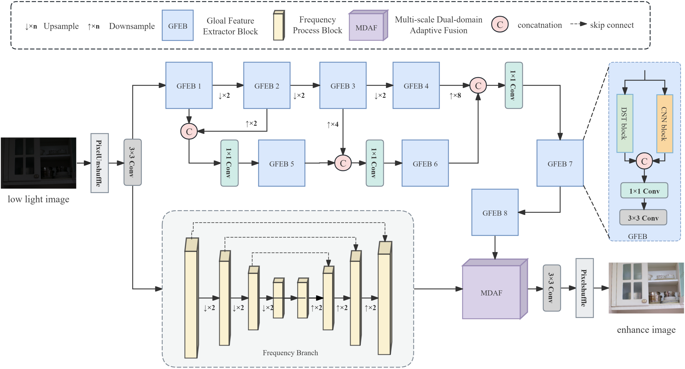
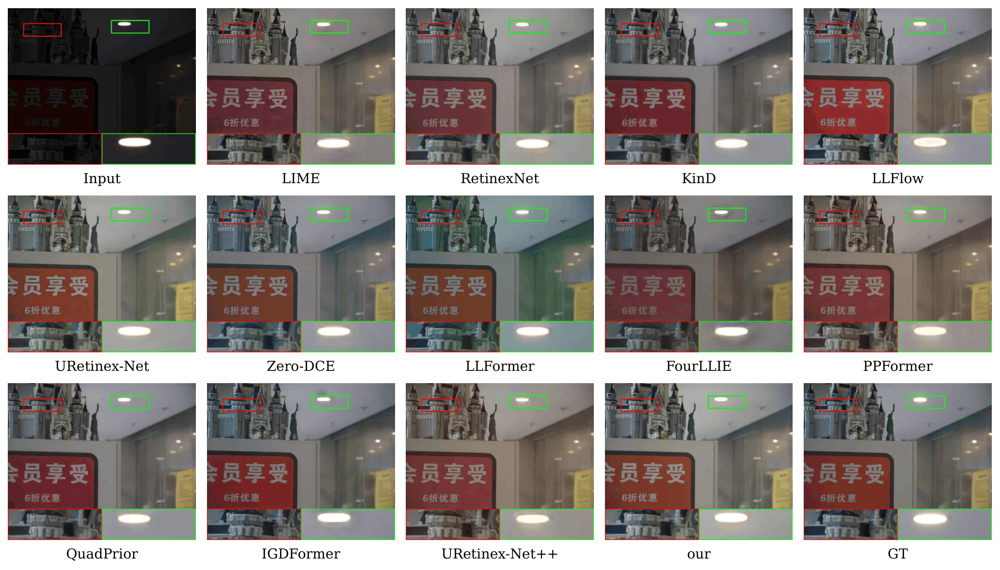

# FDSA-Net: A frequency-guided dynamic sparse attention network with dual-domain fusion for low-light image enhancement

## Overview


## Environment Setup
*   Python 3.8+
*   PyTorch 1.10.0+ 
*   CUDA 11.3+
*   Other dependencies: `pip install -r requirements.txt`

## Dataset Preparation
Organize the datasets in the following structure for `dataloader.py`:
```text
data/
├── LOLv1/
│   ├── Train/
│   │   ├── input/
│   │   └── target/
│   └── Test/
│       ├── input/
│       └── target/
├── LOLv2/
│   ├── Train/
│   │   ├── input/
│   │   └── target/
│   └── Test/
│       ├── input/
│       └── target/
```
## Train
make sure your datasets are correctly placed and run:
```bash
python train.py
```
## Test
```bash
python test.py --weights ./checkpoints/best_model.pth --test_dir ./dataset/LOLv1/Test/input/
```
## Inference
test result on LOLv1&LOLv2



